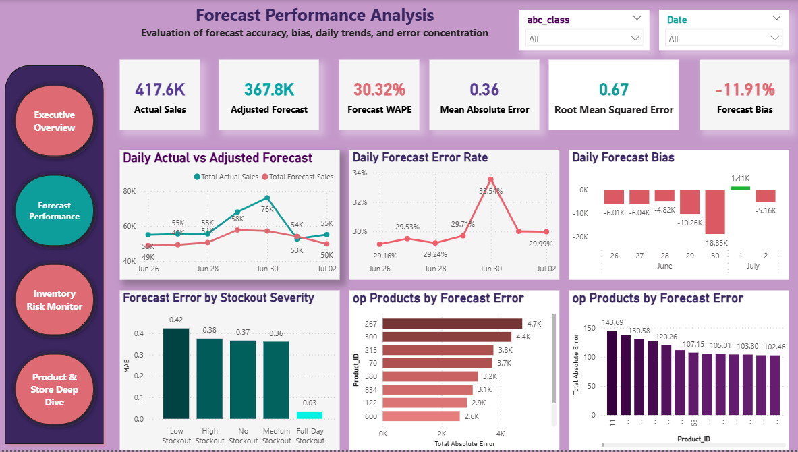

# FreshRetailNet-50K
## Demand Forecasting and Inventory Risk Intelligence

An end-to-end retail analytics project combining Python, SQL, machine learning, inventory risk segmentation, and Power BI to forecast product-store demand and support availability and replenishment decisions.

The project moves beyond traditional sales forecasting by incorporating stockout exposure, product importance, and operational risk into the final analytical framework.

---

## Project Overview

FreshRetailNet-50K was developed to answer four key business questions:

1. What level of daily demand is expected across products and stores?
2. How accurately can future realized sales be forecasted?
3. Which product-store combinations are exposed to stockout and inventory risk?
4. What operational action should be taken for each inventory risk segment?

The final solution consists of three analytical layers:

~~~text
Demand Forecasting
        ↓
Stockout-Aware Forecast Adjustment
        ↓
Inventory Risk Segmentation and Recommended Actions
~~~

Python was used for data preparation, quality validation, exploratory data analysis, feature engineering, forecasting, model evaluation, and inventory risk classification.

SQL was used to support structured data preparation and analytical querying.

Power BI was used to transform the analytical outputs into interactive executive and operational dashboards.

---

## Business Objectives

The main objectives of the project were to:

- Forecast daily sales at the product-store level.
- Compare simple forecasting baselines with machine-learning models.
- Evaluate model performance using MAE, RMSE, WAPE, and forecast bias.
- Understand the relationship between customer demand and stockout exposure.
- Prioritize commercially important products using ABC classification.
- Detect potential demand suppression caused by product unavailability.
- Translate forecasts into actionable inventory risk segments.
- Provide operational recommendations through interactive Power BI dashboards.

---

## Dataset Scope

The analytical dataset is structured at the following grain:

~~~text
Product ID + Store ID + Date
~~~

The project covers:

- **865 products**
- **898 stores**
- **50,000 product-store observations per day**
- **4.5 million training observations**
- **350,000 final evaluation observations**

### Date Coverage

- **Training period:** 28 March 2024 to 25 June 2024
- **Time-based validation period:** 12 June 2024 to 25 June 2024
- **Final evaluation period:** 26 June 2024 to 2 July 2024

The dataset includes:

- Daily sales
- Product hierarchy
- Store and city identifiers
- Discount information
- Holiday indicators
- Promotional activity indicators
- Weather variables
- Stockout exposure

> **Data Availability Notice:** Dataset files are not included in this repository.

---

## Project Workflow

~~~text
Data Collection
        ↓
Data Understanding
        ↓
Data Preparation and Validation
        ↓
Exploratory Data Analysis
        ↓
Feature Engineering
        ↓
Baseline Forecasting
        ↓
Machine-Learning Modeling
        ↓
Ensemble Forecasting
        ↓
Stockout-Aware Adjustment
        ↓
Final Evaluation
        ↓
Inventory Risk Framework
        ↓
Power BI Reporting
~~~

---

## Data Preparation and Validation

The data preparation stage included:

- Date conversion and chronological sorting
- Product-store-date uniqueness checks
- Schema and data-type validation
- Training and evaluation consistency checks
- Date continuity assessment
- Missing-value analysis
- Numerical range validation
- Product-store coverage validation
- Zero-sales analysis
- Stockout and zero-sales cross-analysis

The prepared datasets maintained the following analytical grain:

~~~text
One row per product, store, and date
~~~

---

## Exploratory Data Analysis

The exploratory analysis covered:

- Overall demand trends
- Day-of-week seasonality
- Weekend demand behavior
- Holiday effects
- Activity and promotion effects
- Discount impact
- Product performance
- Store and city performance
- Product-category performance
- Stockout severity
- Weather-related demand variation
- Sales and stockout relationships

---

## Key EDA Findings

### Demand Concentration

ABC classification showed that:

- **121 A-class products** contributed approximately **79.86%** of total training sales.
- **167 B-class products** contributed approximately **15.10%**.
- **577 C-class products** contributed approximately **5.04%**.

This indicates that a relatively small number of products generates most of the commercial value.

### Stockout Exposure

Approximately **44.27%** of product-store-date observations experienced at least one stockout hour.

Full-day stockout observations recorded extremely low sales and a zero-sales rate of approximately **81.44%**.

### Sales and Stockout Relationship

Higher-demand products, stores, and categories frequently accumulated more stockout exposure.

The approximate correlation between sales and total stockout exposure was:

- **0.72** at product level
- **0.96** at store level
- **0.94** at second-category level
- **0.80** at third-category level

This indicates that stockout exposure is frequently associated with strong demand pressure.

### Calendar and Business Effects

- Weekend demand was higher than weekday demand.
- Holiday demand was higher than non-holiday demand.
- Stronger discounts were associated with higher average sales.
- Promotional periods were associated with stronger inventory pressure.
- Weather variables provided supporting signals but were weaker than historical demand, discounts, holidays, and stockout indicators.

---

## Feature Engineering

The modeling dataset included calendar, historical demand, rolling demand, stockout, business-event, and weather features.

### Calendar Features

~~~text
day_of_week
is_weekend
day_of_month
week_of_year
month
~~~

### Sales Lag Features

~~~text
sales_lag_1
sales_lag_7
sales_lag_14
sales_lag_28
~~~

### Rolling Sales Features

~~~text
rolling_mean_7
rolling_mean_14
rolling_mean_28
rolling_std_7
~~~

### Stockout Features

~~~text
stockout_lag_1
rolling_stockout_mean_7
rolling_stockout_sum_7
rolling_stockout_mean_14
~~~

### Business Interaction Features

~~~text
discount_bucket
holiday_activity_interaction
weekend_holiday_interaction
~~~

All rolling features were shifted before calculation to prevent target leakage.

After feature engineering and removal of rows without sufficient historical observations, the final modeling dataset contained approximately:

~~~text
3.1 million rows
38 columns
~~~

---

## Forecasting Strategy

A time-based validation strategy was used instead of a random train-test split.

### Training Period

~~~text
25 April 2024 to 11 June 2024
~~~

### Validation Period

~~~text
12 June 2024 to 25 June 2024
~~~

The validation period contained:

~~~text
700,000 product-store-date observations
~~~

This approach simulated a real forecasting process in which historical observations are used to predict a later time period.

---

## Forecasting Models

The following forecasting approaches were evaluated.

### Baseline Models

- Naive forecast using previous-day sales
- Seasonal naive forecast using previous-week sales
- Seven-day moving average
- Twenty-eight-day moving average

### Machine-Learning Models

- HistGradientBoostingRegressor
- Base LightGBM
- Tuned LightGBM
- Weighted ensemble model

The best simple ensemble combined:

~~~text
50% Tuned LightGBM
30% Base LightGBM
20% HistGradientBoosting
~~~

---

## Model Performance

| Model | MAE | RMSE | WAPE |
|---|---:|---:|---:|
| Seven-Day Moving Average Baseline | 0.3831 | 0.6312 | 33.99% |
| HistGradientBoosting | 0.3551 | 0.6193 | 31.51% |
| Base LightGBM | 0.3459 | 0.5905 | 30.69% |
| Tuned LightGBM | 0.3459 | 0.5933 | 30.69% |
| Best Simple Ensemble | 0.3448 | 0.5918 | 30.59% |
| Stockout-Corrected Ensemble | 0.3200 | 0.5476 | 28.40% |

The best-performing simple ensemble combined the three strongest machine-learning models.

---

## Stockout-Aware Forecast Adjustment

Forecast error analysis showed that severe stockout conditions were a major source of error.

The original ensemble continued to predict positive sales in some cases where products were unavailable for most or all of the day.

The following availability-aware adjustment was tested:

~~~text
High Stockout:
Prediction × 0.80

Full-Day Stockout:
Prediction × 0.00
~~~

This adjustment improved validation performance to:

- **MAE:** 0.3200
- **RMSE:** 0.5476
- **WAPE:** 28.40%

The adjustment represents an availability-aware estimate of realized sales.

It should not be interpreted as an unconstrained demand forecast because actual future stockout exposure may not be known at prediction time.

---

## Final Evaluation Performance

The saved forecasting pipeline was applied to a separate seven-day evaluation period covering:

~~~text
26 June 2024 to 2 July 2024
~~~

The final evaluation contained:

~~~text
350,000 product-store-date observations
~~~

The evaluation results were:

- **MAE:** 0.3618
- **RMSE:** 0.6658
- **WAPE:** 30.32%

The model generally followed the direction of daily demand but underpredicted some sharp demand peaks.

The largest forecasting gap occurred on **30 June 2024**:

~~~text
Actual Sales: approximately 76.0K
Adjusted Forecast: approximately 57.2K
~~~

This indicates that sudden high-demand periods remain one of the main forecasting challenges.

---

## ABC Product Classification

Products were classified according to their cumulative sales contribution.

| ABC Class | Product Count | Approximate Sales Contribution | Business Priority |
|---|---:|---:|---|
| A | 121 | 79.86% | Very High |
| B | 167 | 15.10% | Medium |
| C | 577 | 5.04% | Lower |

The forecasting model performed best on A-class products.

After stockout-aware correction, approximate validation WAPE was:

- **A products:** 26.76%
- **B products:** 34.98%
- **C products:** 36.58%

Lower-volume B and C products were more difficult to forecast because their demand patterns were less stable and more intermittent.

---

## Inventory Risk Framework

The forecasting outputs were converted into six operational inventory risk segments.

| Risk Segment | Business Meaning | Recommended Action |
|---|---|---|
| Critical Risk | Important product, strong expected demand, and severe stockout exposure | Immediate replenishment review and availability monitoring |
| High Priority | Strong demand with severe availability pressure | Prioritize stock review and monitor near-term demand |
| Constrained Demand Candidate | Low realized sales, stronger demand signal, and severe stockout exposure | Investigate potential demand suppression |
| High Demand Monitor | Strong expected demand with manageable stockout exposure | Maintain availability and monitor demand |
| Monitor | Moderate demand or availability exposure | Review regularly |
| Low Priority | Lower demand and limited availability risk | Use the standard replenishment process |

The Inventory Risk Framework identified:

- **5,936 Critical Risk observations**
- **425 High Priority observations**
- **1,171 Constrained Demand Candidates**
- **74,175 High Demand Monitor observations**

Each observation represents one:

~~~text
Product + Store + Date
~~~

---

# Power BI Dashboards

The Power BI report contains four interactive pages designed for executive monitoring and operational analysis.

---

## 1. Executive Overview

The Executive Overview presents:

- Actual sales
- Adjusted forecast sales
- Forecast WAPE
- Forecast bias
- Critical Risk cases
- High Priority cases
- Constrained Demand Candidates
- Stockout exposure
- Inventory risk distribution
- Recommended actions

---

## 2. Forecast Performance

The Forecast Performance page evaluates:

- Daily actual versus forecast sales
- WAPE, MAE, and RMSE
- Daily forecast bias
- Error by stockout severity
- Products contributing the most forecast error
- Stores contributing the most forecast error

---

## 3. Inventory Risk Monitor

The Inventory Risk Monitor supports operational prioritization through:

- Critical Risk monitoring
- High Priority monitoring
- Constrained Demand analysis
- Stockout exposure by risk segment
- Risk analysis by ABC class
- Recommended inventory actions
- Priority product-store cases

---

## 4. Product and Store Deep Dive

The Product and Store Deep Dive provides detailed analysis by:

- Product
- Store
- City
- ABC class
- Date
- Forecast accuracy
- Stockout severity
- Inventory risk segment
- Recommended action

---

## Business Recommendations

### Prioritize A-Class Products

A-class products should receive the highest forecasting, replenishment, and availability-monitoring priority because they generate most of the sales value.

### Establish a Critical Risk Queue

Critical Risk cases should be presented as an operational work queue containing:

- Product
- Store
- Date
- ABC class
- Forecast demand
- Stockout severity
- Recommended action

### Protect High Demand Monitor Products

High Demand Monitor products contain significant commercial value.

Their availability should be protected before they move into Critical Risk.

### Investigate Constrained Demand Candidates

Constrained Demand Candidates should not be treated as ordinary low-sales products.

Low observed sales may be caused by product unavailability rather than weak customer demand.

### Coordinate Promotions with Inventory Availability

Promotional activity and strong discounts should be coordinated with:

- Inventory availability
- Store-level stockout history
- Replenishment lead time
- Expected demand uplift

### Monitor Forecast Bias

The model showed a tendency toward underprediction during high-demand periods.

Daily forecast bias should be monitored, especially around holidays, promotions, and demand peaks.

---

## Limitations

- The training history covers approximately 90 days.
- The final evaluation covers only seven future days.
- Model selection used a single time-based validation window.
- The stockout-aware adjustment uses same-day availability information.
- Observed sales may represent constrained sales rather than unconstrained customer demand.
- Direct inventory quantities were not available.
- Reorder points and safety-stock values were not available.
- Supplier lead times and purchase orders were not available.
- Product and store fields were represented mainly by numerical identifiers.
- Lower-volume B and C products showed higher relative forecasting error.
- Inventory risk thresholds are analytical business rules and have not yet been financially optimized.

---

## Future Work

Future improvements may include:

- Rolling-origin backtesting across multiple historical windows
- Separate unconstrained-demand and availability-risk models
- Predicted stockout exposure for future forecasting
- Inventory-on-hand and safety-stock integration
- Supplier lead-time and purchase-order integration
- Prediction intervals
- Financial optimization using product margins and lost-sales costs
- Intermittent-demand models for B and C products
- Enhanced peak-demand features
- Automated forecasting and Power BI refresh
- Row-level security
- Drill-through pages
- Report-page tooltips
- Mobile Power BI layouts

---

## Repository Structure

~~~text
FreshRetailNet-50K/
│
├── Python/
│   ├── 1_Getting_datasets.ipynb
│   ├── 2_Data_Understanding.ipynb
│   ├── 3_DATA_Ingestion_and_Preparation.ipynb
│   ├── 4_SQL_Loading_Data.ipynb
│   ├── 5_Python_Preparation_Layer.ipynb
│   ├── 6_Feature_Engineering.ipynb
│   └── 7_Inventory_Risk_Framework.ipynb
│
├── SQL/
│   └── Fresh_Retail.sql
│
├── Project_Report/
│   └── Report.pdf
│
├── Executive Overview.png
├── Forecast_Performance_Analysis.png
├── Inventory Risk Monitor.png
├── Product and Store Performance.png
├── README.md
├── requirements.txt
├── .gitignore
└── LICENSE
~~~

---

## Technologies Used

- Python
- Pandas
- NumPy
- Matplotlib
- Scikit-learn
- LightGBM
- SQL
- Power BI
- DAX
- Power Query
- Jupyter Notebook
- Git
- GitHub

---

## Reproducibility

Dataset files are not included in this repository.

To reproduce the analysis:

1. Obtain the dataset from the authorized source.
2. Place the dataset files in the expected local data directory.
3. Install the required Python packages:

~~~bash
pip install -r requirements.txt
~~~

4. Run the notebooks in numerical order.
5. Update local file paths where required.
6. Open the Power BI report and update its data-source location if necessary.

---

## Data Source and Attribution

The dataset used in this project is synthetic and was used for educational, analytical, and portfolio purposes.

Dataset attribution:

~~~text
Synthetic retail dataset attributed to River @ Rivalytics.
~~~

The dataset is not redistributed through this repository.

Users who wish to reproduce the analysis should obtain the dataset from its authorized source and comply with its applicable attribution and licensing requirements.

Dataset license:

~~~text
Creative Commons Attribution 4.0 International (CC BY 4.0)
~~~

The attribution statement is included for compliance and documentation purposes. No ownership of the original dataset is claimed by this repository.

---

## License Scope Notice

The MIT License in this repository applies only to the original:

- Python code
- SQL scripts
- Jupyter notebooks
- Analytical logic
- Project documentation

The MIT License does not apply to:

- The original dataset
- Third-party data
- Third-party source materials
- External software dependencies
- Third-party trademarks
- Content governed by separate licensing terms

Dataset ownership is not transferred through this repository.

Generated reports, model outputs, screenshots, and dashboards are provided for educational and portfolio demonstration purposes.

The project outputs should not be interpreted as verified commercial forecasts or production inventory recommendations without additional validation.

---

## Author

**Ramy Safwat**

Business and Data Analytics Portfolio

https://github.com/RamySafwatBusinessAnalyst
